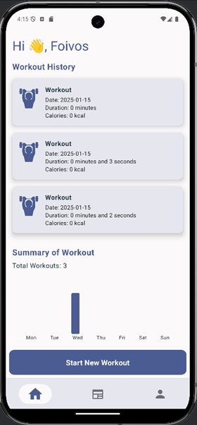
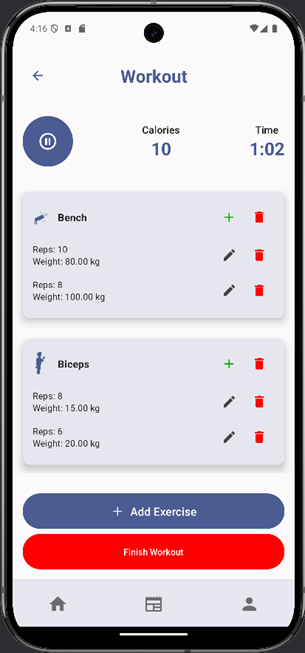
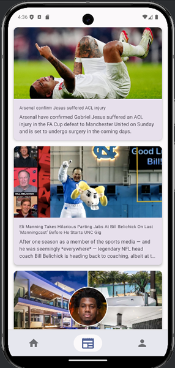
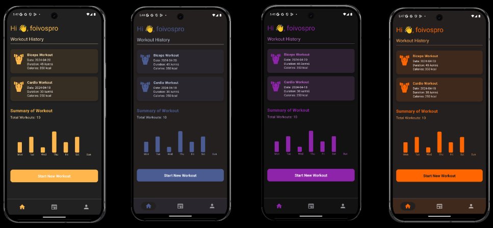

# 🏋️‍♀️ GYM APP 📱  
Your ultimate companion to crush your fitness goals! 💪

---

## 🌟 Features  
- **📊 Track Your Progress**  
  Log every rep and set effortlessly, and watch your fitness journey unfold!  
- **📰 Stay Informed**  
  Get the latest sports news right in your app.  
- **🗓️ Plan Smarter**  
  Visualize your workouts for the week and beyond.  
- **🎨 Customization at Its Best**  
  Switch to dark mode 🌙, or pick your favorite app colors to make it yours.  
- **👤 Personalized Profile**  
  Edit your details and stay in control with seamless profile management.  

---

## 📱 App Architecture  
Designed with **clean architecture** to ensure:  
- **Separation of Concerns** 🧹  
- **Error Feedback & Handling** ⚠️  
- **Dependency Injection** for flexibility 💉  
- **Best Practices in UI & Data Management**  

### 🔍 Key Layers:  
1. **UI Layer** 🎨  
   - Includes interactive views and navigation.  
2. **Data Layer** 📂  
   - Integrated **Database** 🗄️.  
   - Handles **Entities**, **DAOs**, and **Repositories**.  

---

## 🖥️ Screenshots & Navigation  
- **Home**: Your fitness dashboard!

 - **Current Workout Session**: An easy way to manage your workouts

 

 - **Athletics News**: Keep in contact with current affairs 📰

  

 - **Different Dark Mode Colors Palette**: Home off user preference 🎨

---

## 🚀 How to Get Started  
1. **Download and build the app**.
2. Create your account and log in! 🔐  
3. Start logging workouts, track progress, and stay motivated. 🏆  

---

## 👨‍💻 About Us  
We’re **Material Wifes**, a passionate team of developers dedicated to making fitness accessible and fun:  
- Dimitris Doukas  
- Foivos Proestakis  
- Giannis Karyotakis  
- Giorgos Markogiannis  

## 🛠️ Technologies Used  
- **Android** (Java/Kotlin)  
- **SQLite / Room** for database management  
- **MVVM Architecture**  
- **Retrofit** for seamless API integration  

---

## 🌐 Let's Connect!  
Got questions? Feedback? We’d love to hear from you!   
